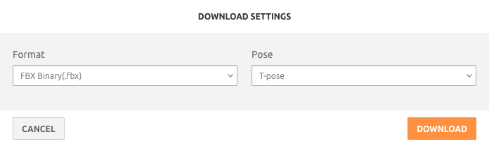
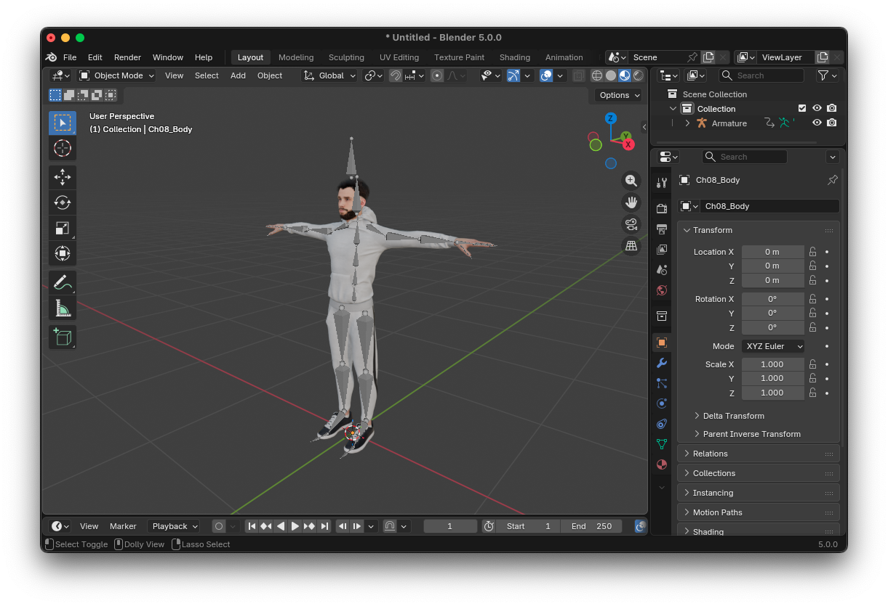
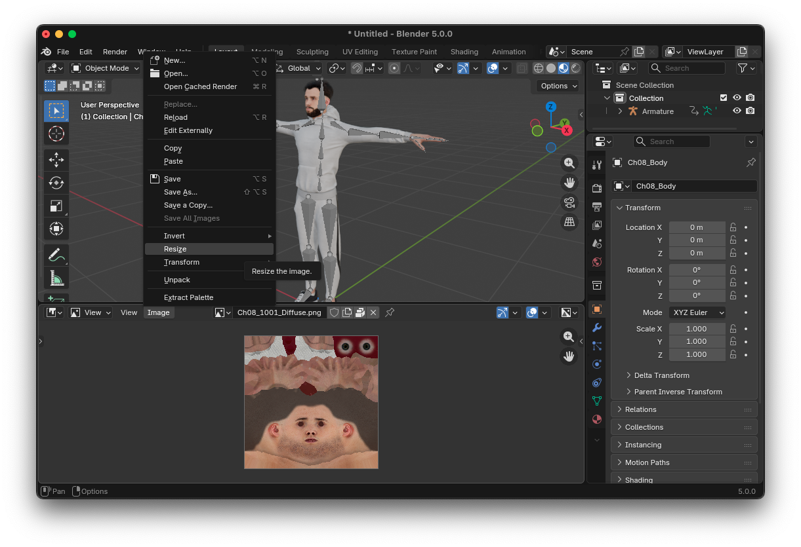
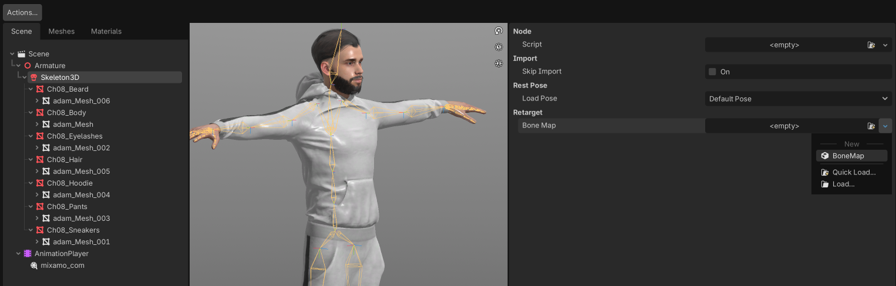
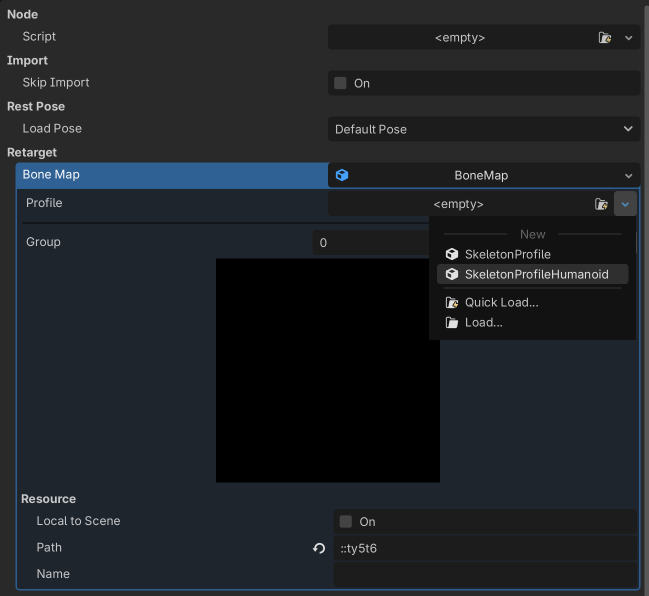
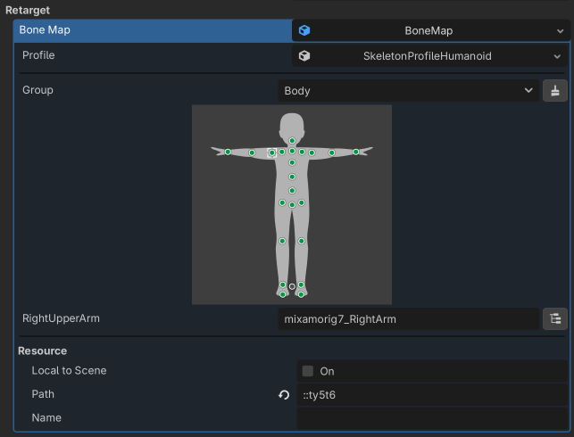
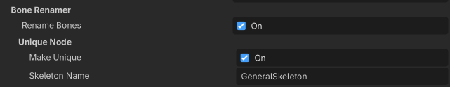
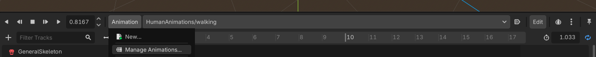
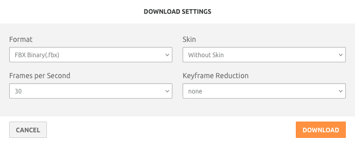
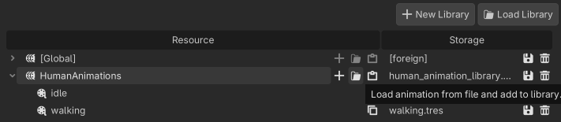

## Adding new human bodies to the available humans

Currently, all our humans come from [Mixamo](www.mixamo.com).

### Downloading a new human body

Go to [Mixamo](www.mixamo.com), select a character and download it without adding an animation.

### Editing in Blender

In Blender, start a new file and delete the cube, light and camera. Then import the FBX you just downloaded.

Open the Image pane, and for every image in the file (including normal maps, diffuse maps, etc.), resize it to 512x512 pixels. If you don't, the final file will be way too large and may not even by allowed on GitHub.

Export as glTF (.gdb) in `src/objects/humans` with the other human bodies.

Save the Blender file (.blend) in `art_sources` with the other humans. Say "Yes" when asked if you want to save the images, so that they are reduced in the `.blend` file (otherwise the file is too large for commiting on git).

You can now delete the original FBX file from Mixamo.

### Importing in Godot

In Godot, double-click the .gdb file you just added. We need to remap the skeleton to a new generic skeleton so that every animation fit this new body. First, select Skeleton3D, then create a new BoneMap in the Retarget section.

Click on the BoneMap you just added, and select a SkeletonProfileHumanoid in Profile.

Normally, Godot should have mapped bone from the glTF to the (simpler) skeleton you just created. For instance, here we check that the mixamorig7_RightArm bone will be renamed RightUpperArm in the imported skeleton.

Ensure that these options are selected in the Bone Renamer section:

Then click Reimport.

Create a new inherited scene from the glb file (right-click the glb file and select "New Inherited Scene"), update the casing of the root node (e.g. Adam instead of adam) and save this new scene in the same folder as the glb file (e.g., adam.tscn).

### Correcting the glossy map

There's a bug somewhere in the conversion of glossiness/roughness. The glossiness textures exported from the glTF are glossy maps, while they are mapped to roughness maps in the material. To correct this, use an external image editor to invert colours in the "Glossiness" textures (they should be green, not magenta).

### Adding the human animation library to this new body

In the new `.tscn` you created, select the AnimationPlayer and select "Animation/Manage Animations...".

Click on the "Load Library" button and select `human_animation_librari.tres`, in the human animations folder. All animations are then available for this new body.

### Adding the human animator script to this new body

Still in the new `.tscn` you created, add the `human_animator.gd` script to the main node. This is the script that commands the animations for all humans bodies.

## Adding a new animation to the available animations

### Downloading a new animation

Go to [Mixamo](www.mixamo.com), select a generic character, then go to the Animations tab and select an animation. Download it without skin.

### Importing into Godot

Temporarily add the FBX you just downloaded to the Godot project, and double-click on it.

Select `mixamo_com` in the AnimationPlayer, select "Linear" in "Loop Mode", select "Enable" in "Save to File", and save it with the other animations as a `.tres` file in `res://objects/humans/animations`.

Select the Skeleton3D and do the exact same retargeting steps as above when we added a new human body. This is so that the animation is retargeted to Godot's generic skeleton.

Click Reimport.

Now delete the animation FBX you added in the first step, we don't need it anymore.

### Adding to the human animation library

Open any human `.tscn` file, then select its AnimationPlayer, and select "Animation/Manage Animations...".

Select the folder icon to load an animation from file and add to the library.

Select the `.tres` animation you just created, then save the HumanAnimations library using its Save icon. The new animation is now available for every human.

