# Developing new maps

A map is the combination of a terrain (ground and walls geometry) and of different objects such as lights, static bodies for collisions, navigation meshes for NPCs, and various static elements such as trees and benches. In this tutorial, we will create a map using the terrain we created [previously](developing_new_terrains.md).

## Creating the map in Godot

In Godot, create a new 3D scene, and drag-and-drop the `demo_terrain.fbx` file you just created. Name it "Demo", and save it as `res://maps/demo/demo.tscn`.

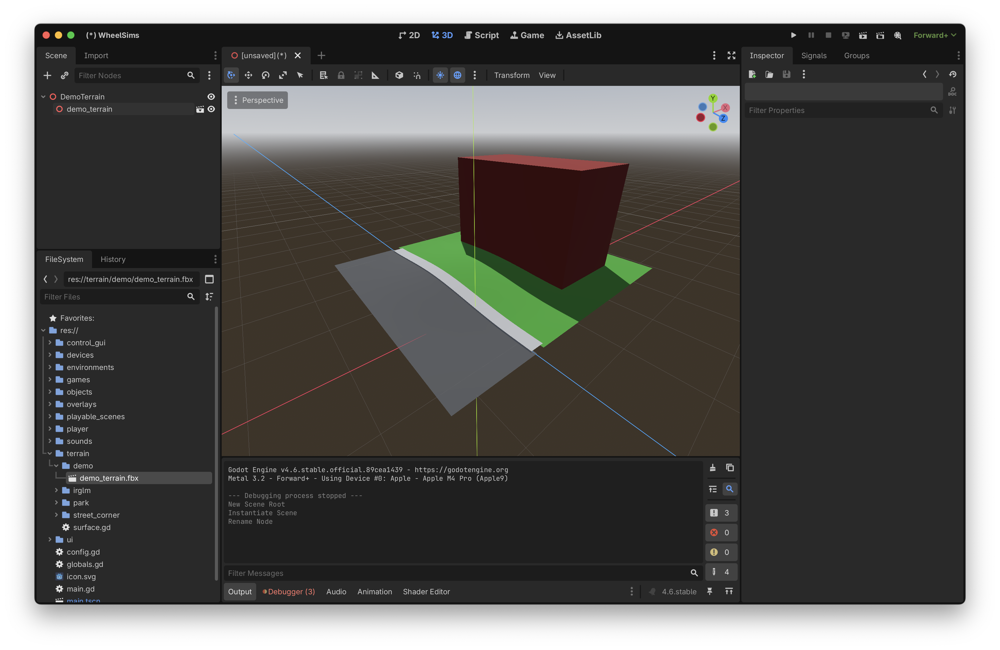

## Creating the lighting

Add a WorldEnvironment node, and select `park_environment.tres` in the inspector (this is the world environment used by the park scene).

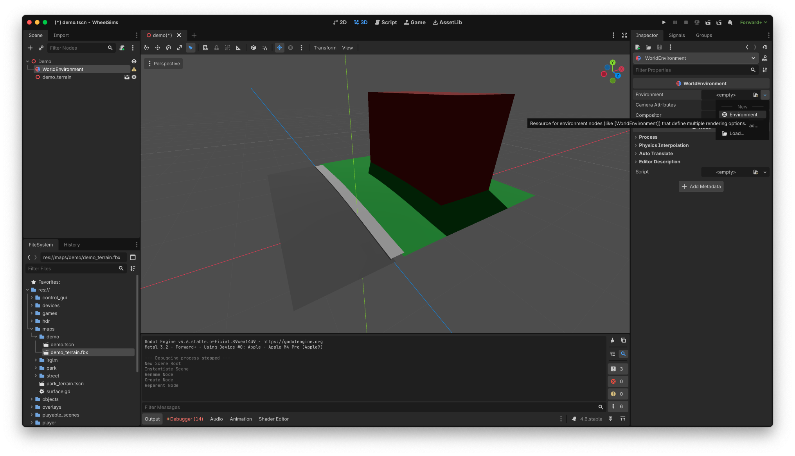

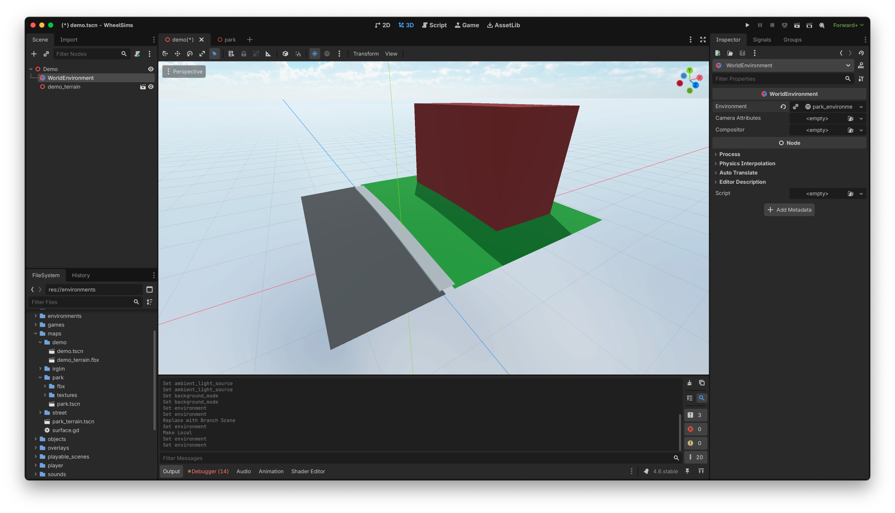

Also add a DirectionalLight3D node, which will generate the shadows later.

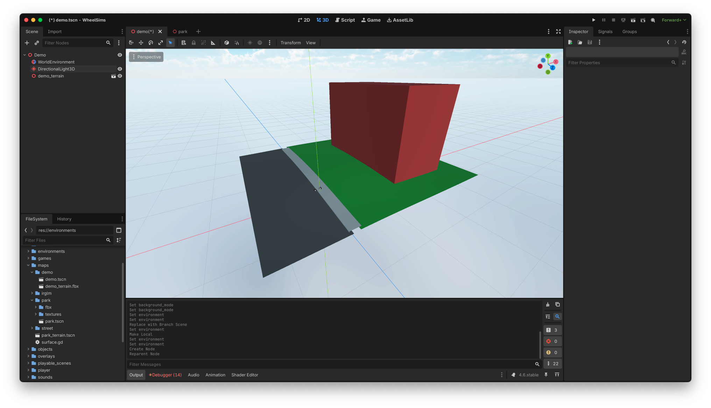
## Creating the collision surfaces

Right-click on `demo_terrain` in the scene arborescence and select `Editable children`. This reveals the different meshes you created in Blender. For every ground surface, select `Mesh` → `Create Collision Shape...`, and select `Static Body Child` and `Trimesh` as options.

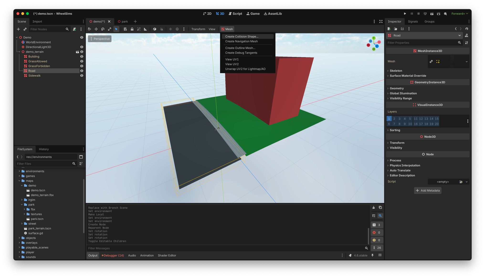

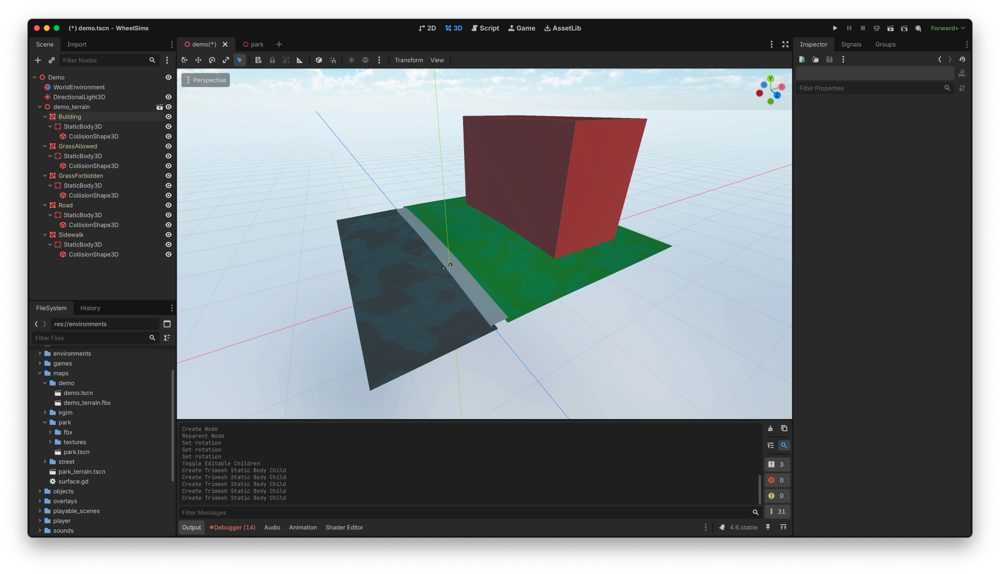

## Creating navigation regions

We need to organize these collision shapes elsewhere in the hierarchy, for two reasons:
1. We don't want the collision shapes to be part of the imported FBX, so that improving the FBX later and reimporting it won't mess with the collision shapes.
2. These collision shapes must belong to navigation paths, so that we can bake these paths for NPC navigation.

Create different NavigationRegion3D for the NPCs: one for every part of the map where an NPC would go. Then move the collision shape into its NavigationRegion3D. Create an empty Node3D for the collision shapes that don't belong to a navigation region.

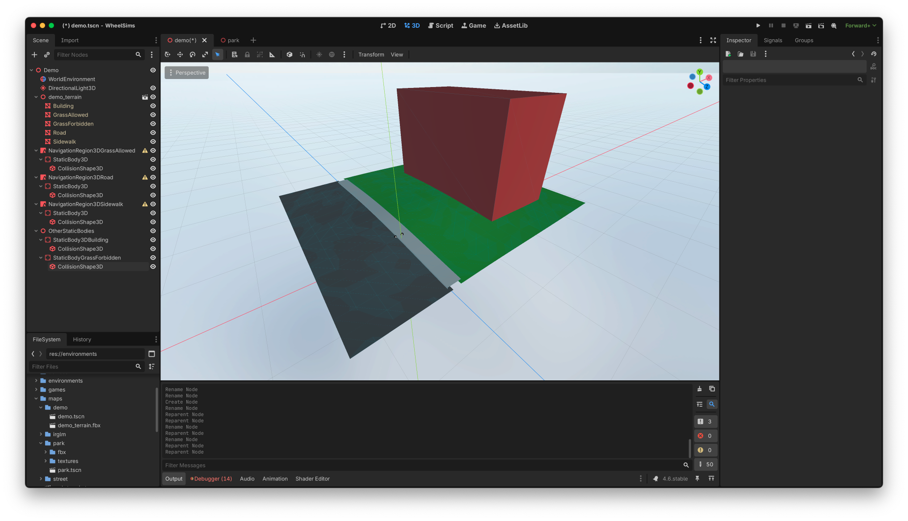

We can now uncheck "Editable Children" on `demo_terrain`.

For every navigation region, create a new navigation mesh.

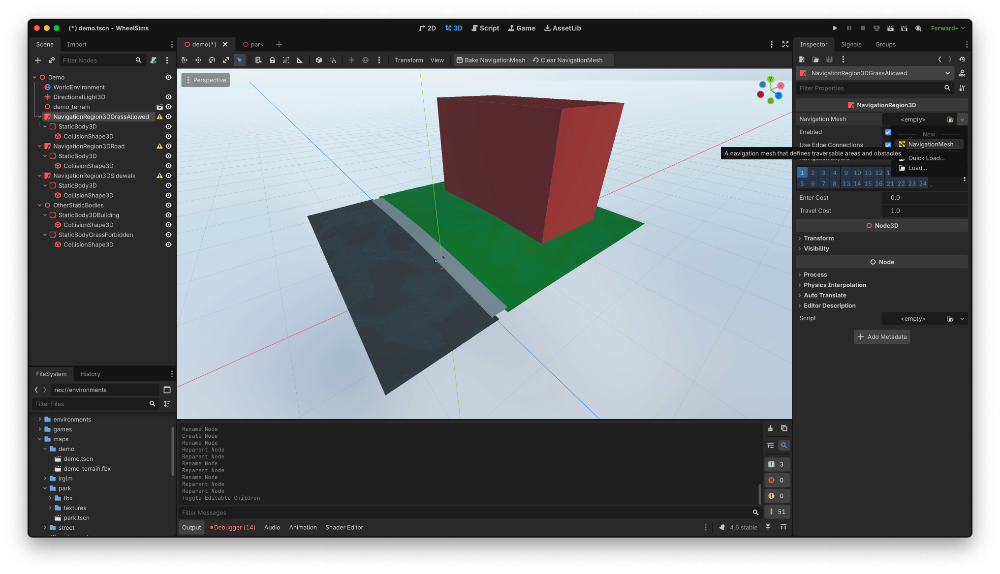

Then click on the yellow, new-created navigation mesh to see its properties. The most important property is the agent radius: it adds a border around the navigation meshes so that the agent does not penetrate into the adjacent objects. Here, set it to 1 meter for the road and grass, but let it at 0.5 meters for the sidewalk (because the sidewalk is too narrow for such a wide border).

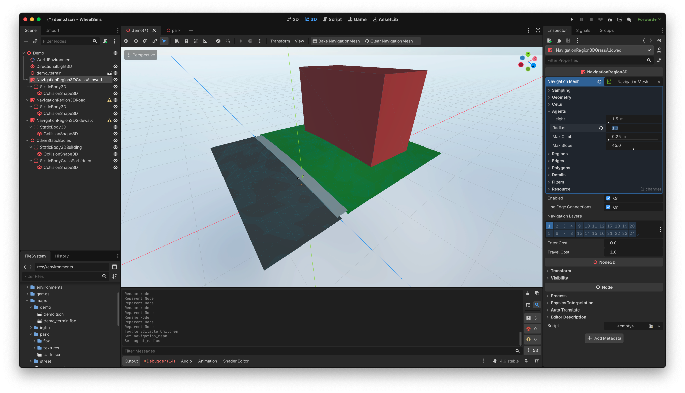

Once you define the desired parameters (here, keep the others to their default values), click "Bake NavigationMesh" to generate the navigation mesh.

The NPCs now have places to go.

## Configuring surfaces and obstacles

By default, every collision surface is considered by WheelSims as an obstacle that should stop the player. Obviously, the ground surface should not behave this way. To define a collision surface as the ground, drag the `surface.gd` script to each StaticBody3D that is a surface and not a wall.

You can then set the rolling resistance parameter in the inspector for each surface.

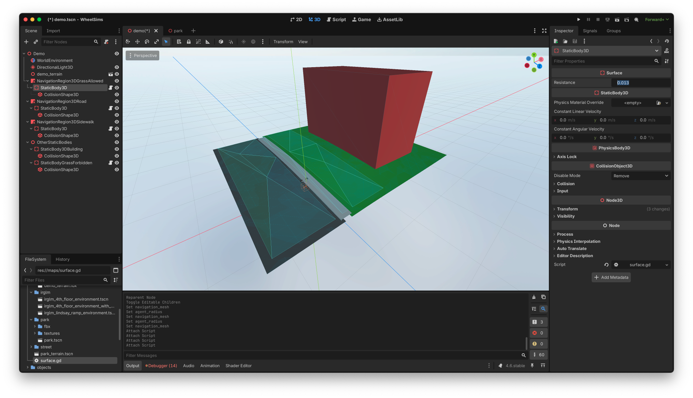

## Adding static objects

Each static object that has an impact on the trajectory of an NPC must be added as a child of the navigation region it resides on. We can then rebake the navigation mesh so that the NPCs avoid the obstacle. Let's try with a tree.

Add a tree to the scene, as a child of the AllowedGrass navigation region.

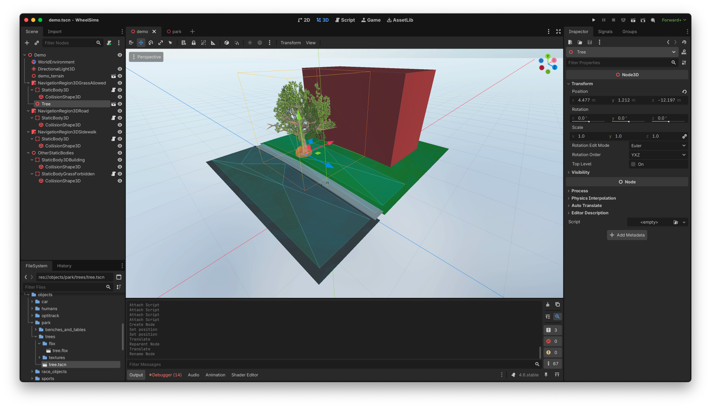

The tree comes with an obstacle object (the orange sphere), so that when we rebake the AllowedGrass navigation mesh, it now avoids the tree.

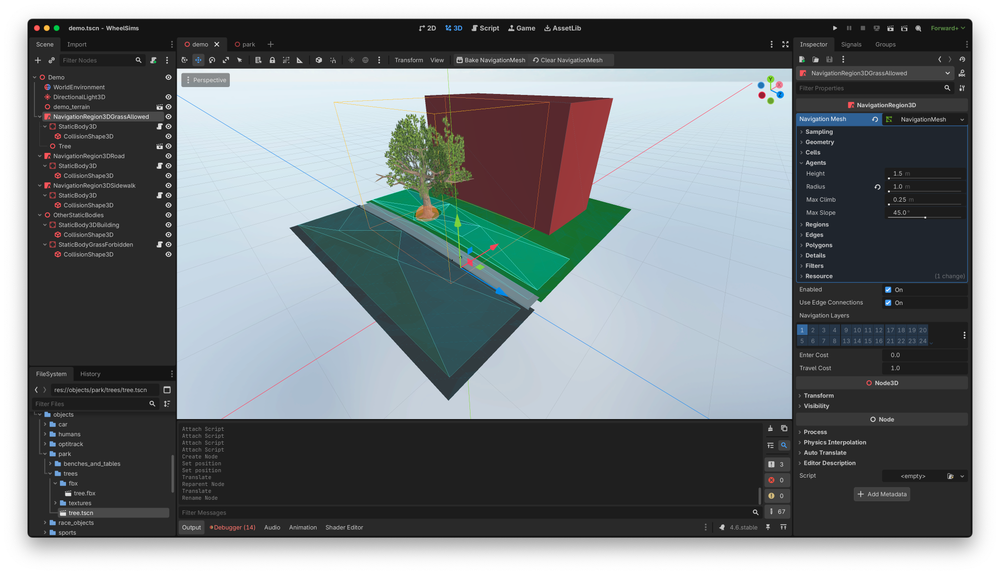

You're done, the map is complete and can now be used in a [playable scene](developing_new_playable_scenes.md)
