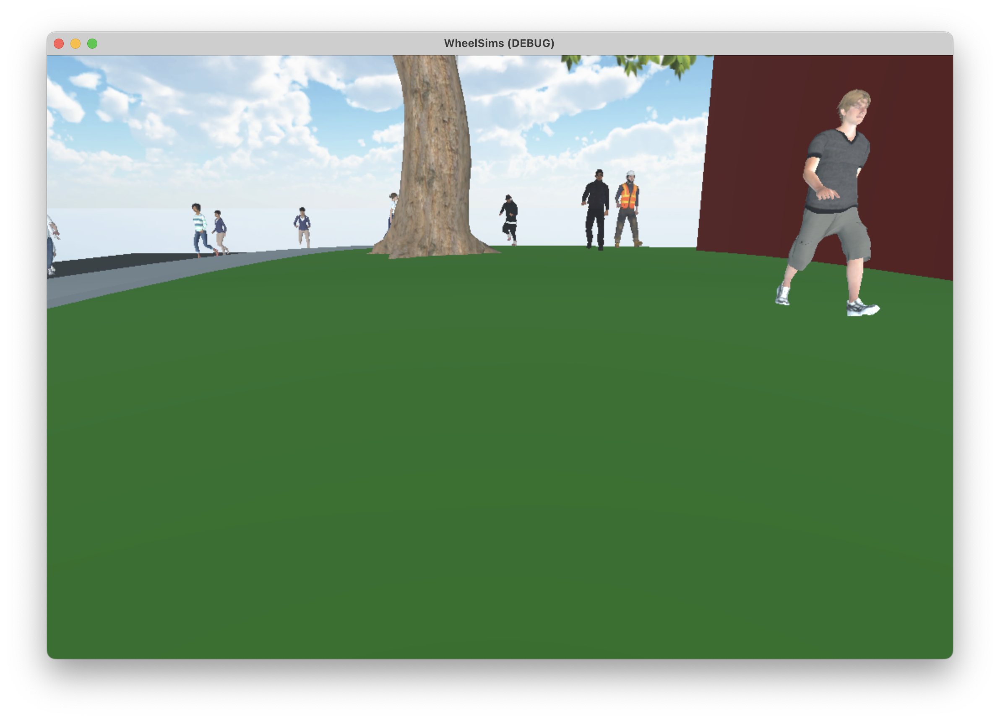

# Developing new playable scenes

For a scene to be selectable and playable in the user interface, it needs to:
- Include the player object;
- Be saved into the `res://playable_scenes` folder;
- Optionally, include a screenshot as a PNG image with the same name, in the same folder.

## Creating the playable scene in Godot

Create a new empty 3D scene, and drag to it:
1. A map (here, the map we just did [previously](developing_new_maps.md);
2. The player;
3. If needed, a pedestrian generator.

Save it as `res://playable_scene/demo.tscn`. It should now be available as any other scene in the main user interface. Or you can run it using the "Run Current Scene" option.

When running the scene, we should be able to navigate it and see NPCs wandering in it.

## Add a thumbnail to it

Take a snapshot of the scene and save it as `res://playable_scenes/demo.png`. Now, we have a nice thumbnail in the scene selection menu.

