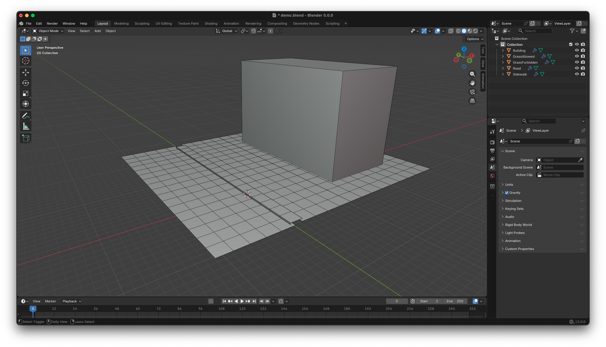
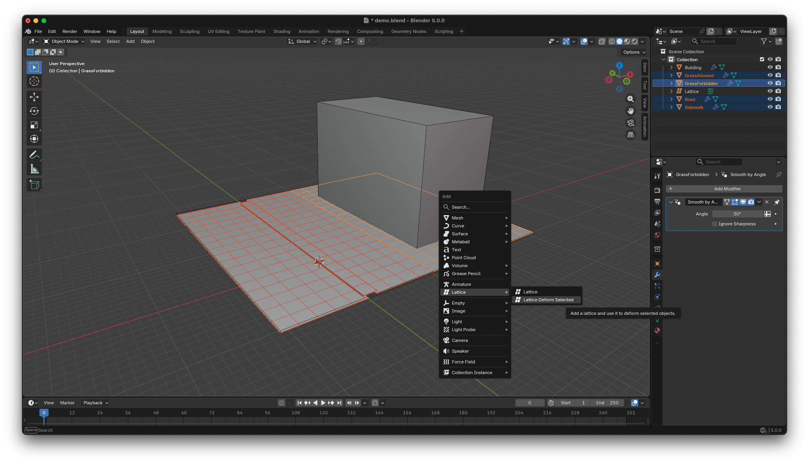
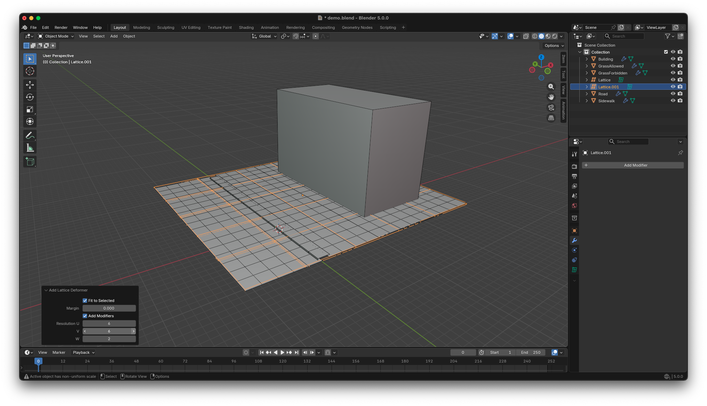
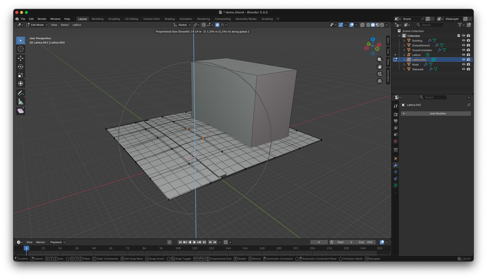
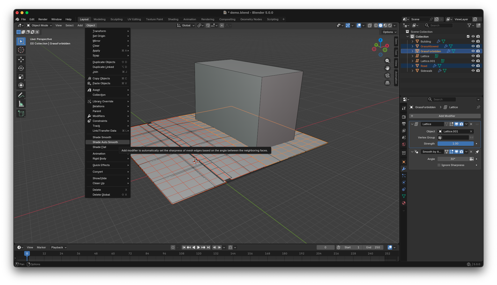
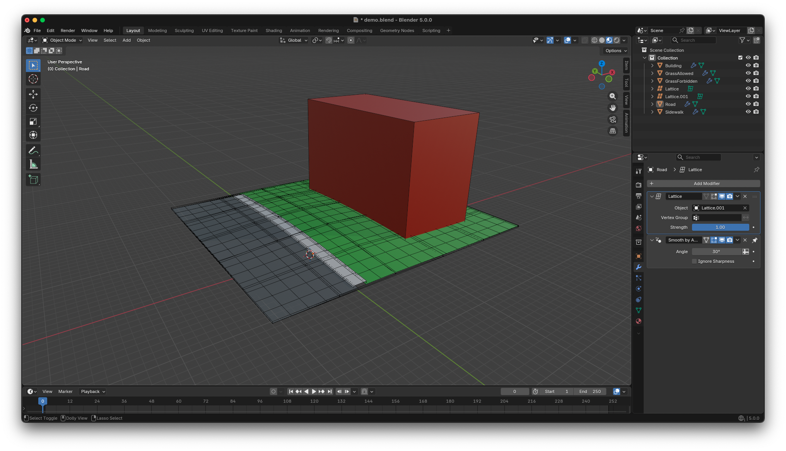
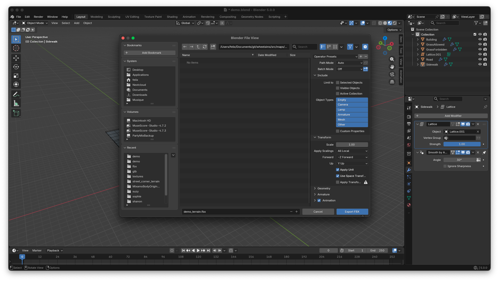

# Developing new terrains in Blender

A terrain is an FBX file that contains the ground and walls, and is generally designed in Blender. Developing a new terrain is always the first step in designing a new playable scene. In this guide, we will develop a very simple terrain that models a road, a widewalk, some grass and a facade.

## Preparing folders

Before creating a new terrain, create these folders:
- `wheelsims/art_source/terrain/demo` that will contain the source Blender file for our terrain;
- `wheelsims/src/maps/demo/fbx` that will contain the exported Blender files;
- `wheelsims/src/maps/demo/textures` that will contain the jpg/png files used as textures for our terrain.

Remember that all folder and file names must be in `snake_case` (lower case with words separated by underscores) according to the [file name conventions](conventions.md).

## Creating the base geometry

Create a basic scene like this one:

This scene has:
- two planes for the grass: one will contain a navigation shape for NPCs and not the other, to prevent NPCs from approaching the building;
- one plane for the road: note that it is lower than the grass planes;
- one mesh for the sidewalk that consists of one horizontal plane bordered by two planes;
- one cube for the building.

## Deforming to account for terrain elevation

To make things a little bit more interesting, we will deform the ground planes and the sidewalk to make a small hill. First add more precision to the meshes so that they can deform: split it in squares of about 2 meter-squared.

*Note that for large scenes, a resolution of 2 meter-squared may be too detailed, and that duch detailed resolutions should be reserved for the few areas with small hills and drops.*

Then select all materials, and apply their scale (CTRL+A, Apply Scale). This will prevent issues later when importing the FBX in Godot.

Now select the ground planes (not the building), and add a lattice object to deform those planes. Here we set the resolution of the lattice to 5x5).

Edit the lattice and raise the middle point with proportional editing in smooth mode to create the desired hill.

Set the ground shading to auto-smooth.

## Applying temporary materials

Create plain colour temporary materials for now. We will add texture later when we know that everything works well.

## Exporting to FBX

Once the terrain is completed in Blender, use File → Export → FBX, select the default options but click `Apply Transforms`, and save as `wheelsims/src/maps/demo/fbx/demo_terrain.fbx`. From this point, the terrain can be imported into Godot.

You can now continue to  to work with this new terrain in Godot.
