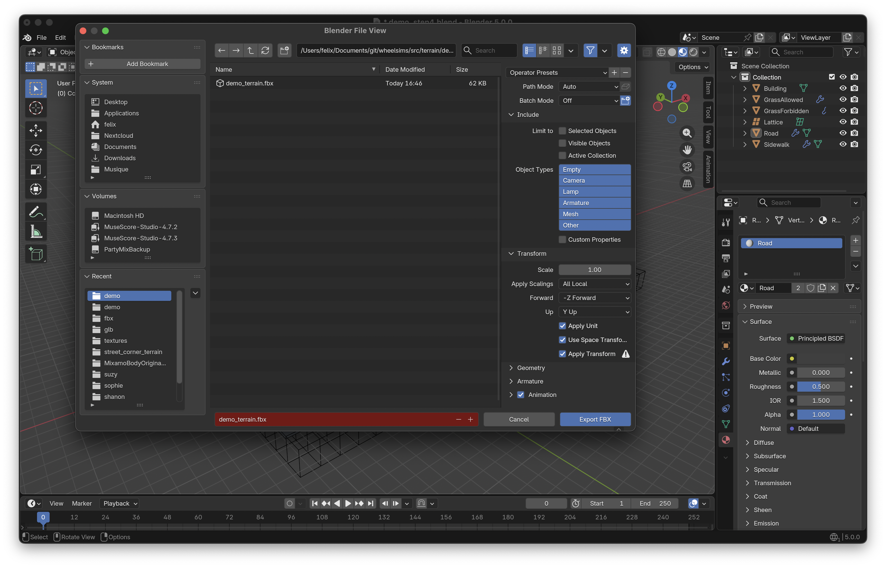
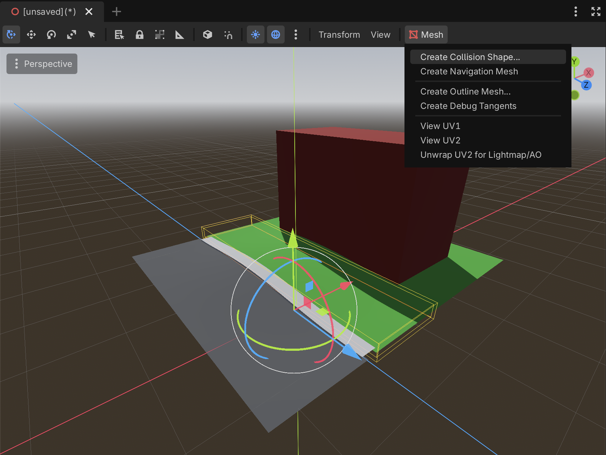
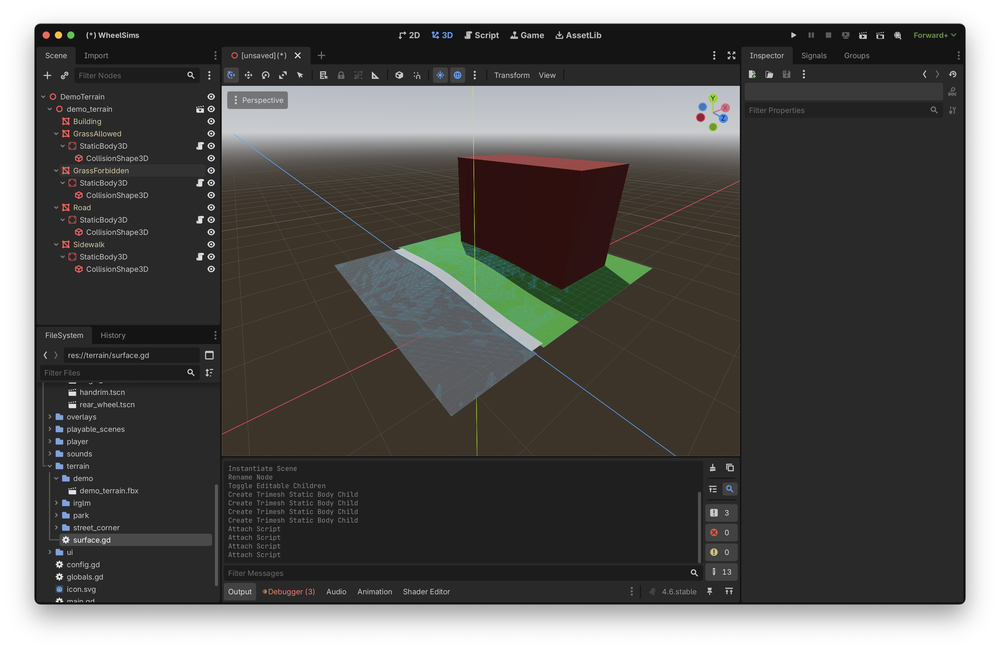
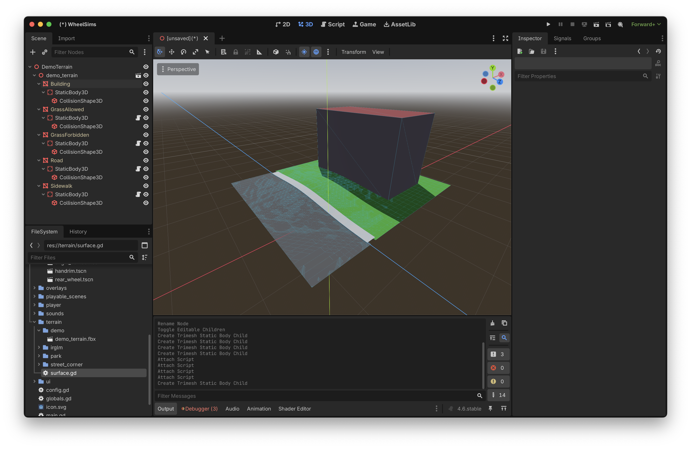
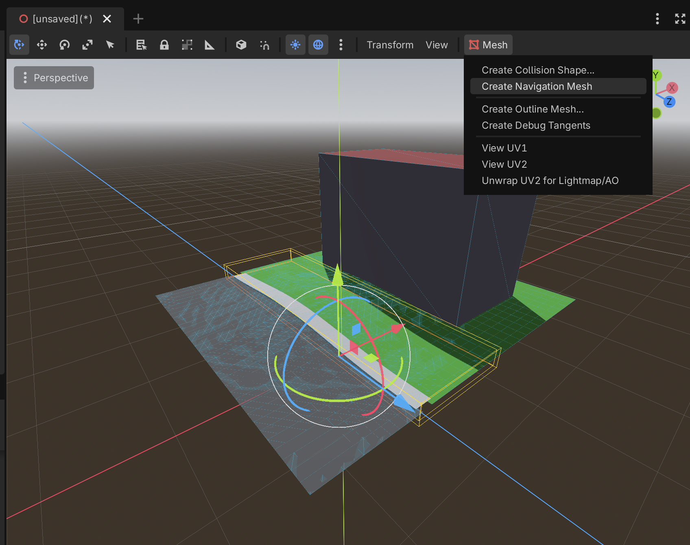
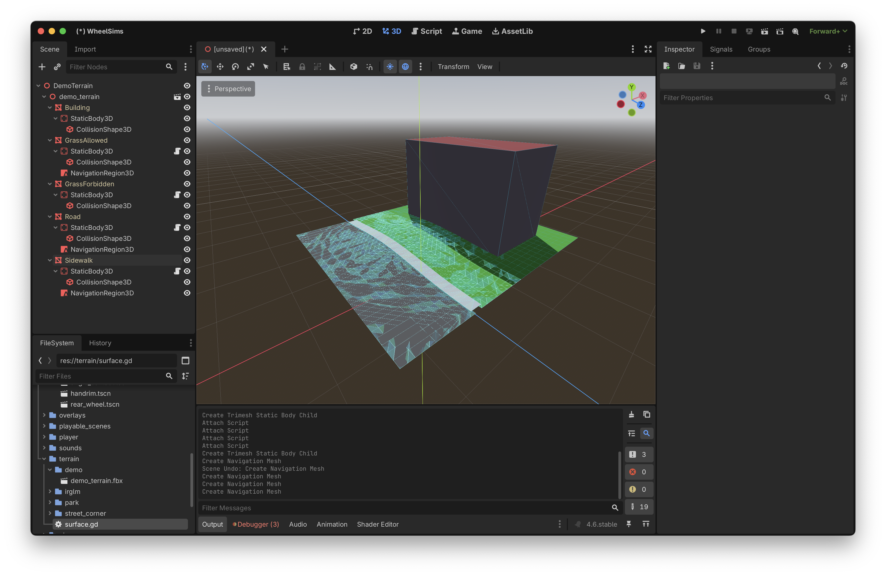
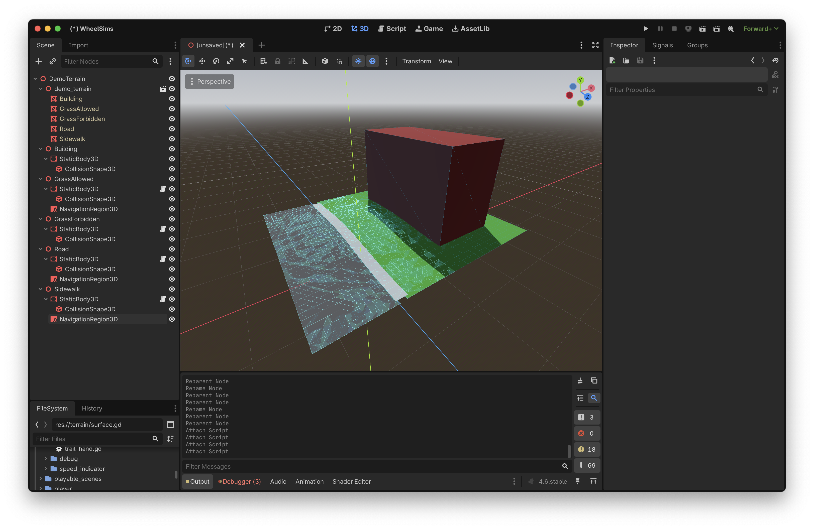
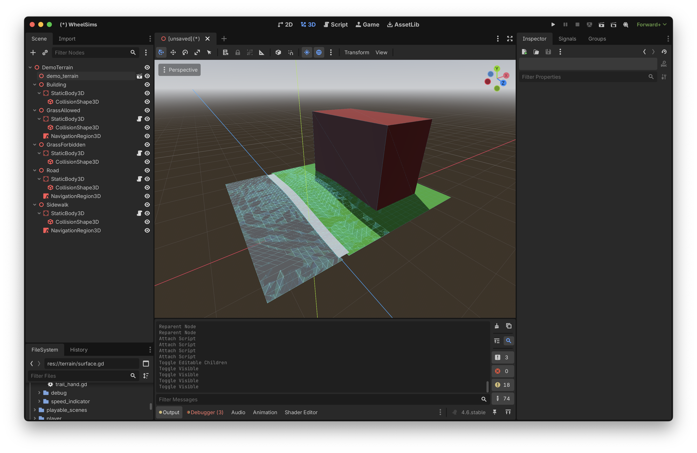
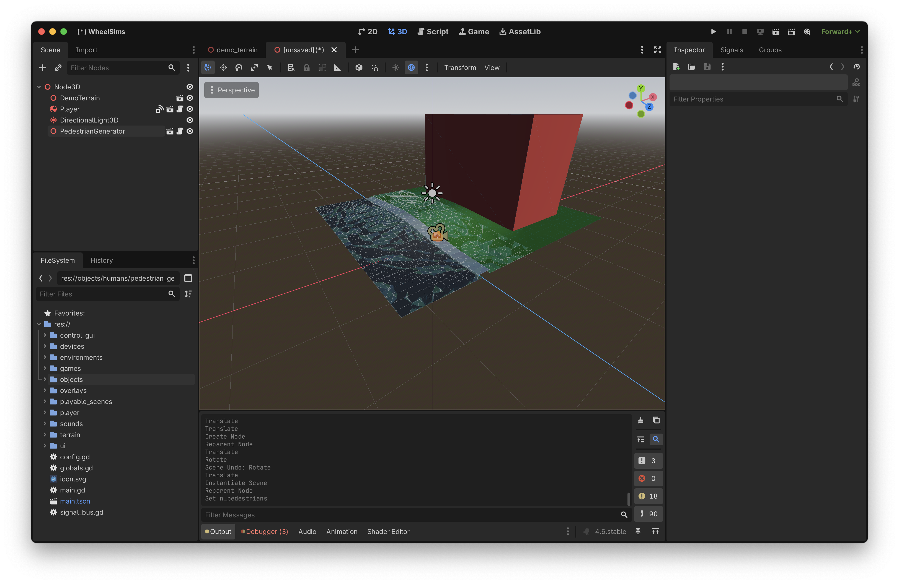
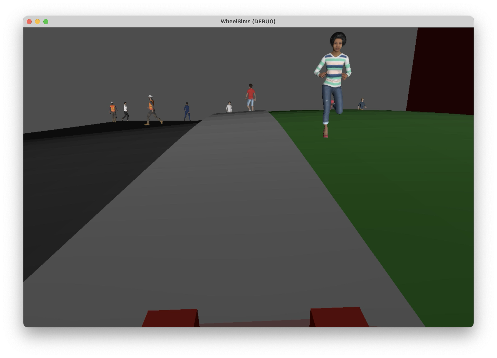

# Developing new terrains

A terrain is a scene that contains the ground and walls. It includes collision shapes so that the player stays on the ground surface, and navigation paths so that NPCs can spawn and go around.

Developing a new terrain is always the first step in designing a new playable scene. In this guide, we will develop a very simple terrain that models a road, a widewalk, some grass and a facade.

## Designing the terrain in Blender

### Preparing folders

Before creating a new terrain, create these folders:
- `wheelsims/art_source/terrain/demo` that will contain the source Blender files for our terrain;
- `wheelsims/src/terrain/demo` that will contain the final terrain scenes used in Godot;
- `wheelsims/src/terrain/demo/fbx` that will contain the exported Blender files;
- `wheelsims/src/terrain/demo/textures` that will contain the jpg/png files used as textures for our terrain.

Remember that all folder and file names must be in `snake_case` (lower case with words separated by underscores) according to the [file name conventions](conventions.md).

### Creating the base geometry

In Blender, create a basic scene like this one:

This scene has:
- two planes for the grass: one will contain a navigation shape for NPCs and not the other, to prevent NPCs to approach or penetrate the building;
- one plane for the road: note that it is lower than the grass planes;
- one mesh for the sidewalk that consists of one horizontal plane bordered by two planes;
- one cube for the building.

### Deforming to account for terrain elevation

To make things a little bit more interesting, we will deform the ground planes and the sidewalk to make a small hill. First add more precision to the meshes so that they can deform: split it in squares of about 1 meter-squared. Note that for large scenes, a resolution of 1 meter-squared may be much too detailed. Such detailed resolutions should be reserved for the few areas with small hills and drops.

Add a lattice object around the scene and increase its resolution a bit (here we set it to 5x5). We use the lattice to create elevation without affecting the original meshes.

For every ground plane (thus excluding the building block), create a Lattice Deform modifier and select the lattice you just created as the source.

Edit the lattice and raise the middle point with proportional editing in smooth mode to create the desired hill.

### Applying temporary materials

Create plain colour temporary materials for now. We will add texture later when we know that everything works well.

### Exporting to FBX

Before exporting, select every mesh and apply scale to it (CTRL+A). Otherwise you may have scaling issues later when creating collision shapes and navigation meshes.

Once the terrain is completed in Blender, use File → Export → FBX, select the default options but click `Apply Transforms`, and save as `wheelsims/src/terrain/demo/demo_terrain.fbx`. From this point, the terrain can be imported into Godot.

## Creating the terrain scene in Godot

In Godot, create a new 3D scene, and drag-and-drop the `demo_terrain.fbx` file you just created, and rename the base node `DemoTerrain`.

### Creating the collision surfaces

Right-click on `demo_terrain` in the scene arborescence and select `Editable children`. This reveals the different meshes you created in Blender.

#### Ground surfaces

For every ground surface, select `Mesh` → `Create Collision Shape...`, and select `Static Body Child` and `Trimesh` as options. 

Then drag the `surface.gd` script to each StaticBody3D to define these collision shapes as surfaces (defined by a rolling resistance) and not walls.

#### Walls

Do the same for the building, but this time without dragging the `surface.gd` script.

### Creating the navigation meshes

For every ground shape that we want to be navigable by NPCs, create a navigation mesh.

### Storing the collision shapes and navigation meshes outside the imported FBX

The terrain we created in Blender is very basic and will probably go several improvements over the time. To avoid conflicts when we will reload it again, move the nodes you created outside the `demo_terrain` node. For clarity, create 3D nodes for every item of the FBX, so that everything is still well organized.

Uncheck `Editable Children` in the original FBX. From now on, we have all the required collision shapes and navigation paths for the terrain, and we can still add visual details to it without changing the behaviour of the game.

Now save this scene as `demo_terrain.tscn`. This is the scene that will be included later when designing environments.

## Testing the terrain in Godot

Create a new 3D scene, add the demo scene you just created, the player, some lighting, and the NPC generator.

If you run this test scene, you should not pass through the ground, you should not be able to penetrate the building, and there should be NPCs everywhere that your allowed it.

