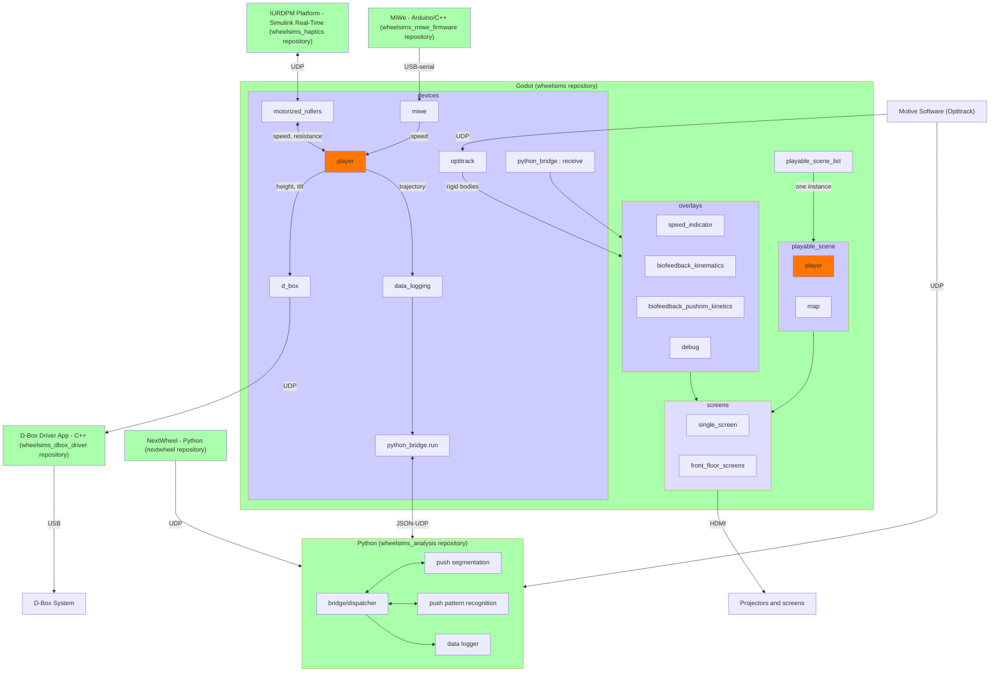

# 🟡 Big picture flowchart

```mermaid
flowchart TD
    subgraph godot ["Godot (wheelsims repository)"]
        playable_scene_list@{"shape: docs, label: #quot;List of playable scenes (one instance at a time)#quot;"}
        playable_scene_list["playable_scene_list"]
        playable_scene["playable_scene"]
        overlays["overlays"]
        screens["screens"]
        subgraph playable_scene ["playable_scene"]
            scene_player["player"]
            map["map"]
        end

        subgraph overlays ["overlays"]
            overlays_speed_indicator["speed_indicator"]
            overlays_biofeedback_push_frequency["biofeedback_kinematics"]
            overlays_biofeedback_push_pattern["biofeedback_pushrim_kinetics"]
            overlays_debug["debug"]
        end

        subgraph devices ["devices"]
            player["player"]
            devices_motorized_rollers["motorized_rollers"]
            devices_miwe["miwe"]
            devices_d_box["d_box"]
            devices_data_logging["data_logging"]
            devices_optitrack["optitrack"]
            python_bridge_send["python_bridge.run"]
            python_bridge_receive["python_bridge : receive"]
        end

        subgraph screens ["screens"]
            single_screen["single_screen"]
            front_floor_screens["front_floor_screens"]
        end

    end

    subgraph python ["Python (wheelsims_analysis repository)"]
        python_python_bridge["bridge/dispatcher"]
        python_push_segmentation["push segmentation"]
        python_push_pattern["push pattern recognition"]
        python_data_logger["data logger"]
    end

    slrt["IURDPM Platform - Simulink Real-Time (wheelsims_haptics repository)"]
    miwe["MiWe - Arduino/C++ (wheelsims_miwe_firmware repository)"]
    motive["Motive Software (Optitrack)"]
    python["python"]
    nextwheel["NextWheel - Python (nextwheel repository)"]
    projectors_and_screens["Projectors and screens"]
    d_box_driver_app["D-Box Driver App - C++ (wheelsims_dbox_driver repository)"]
    d_box_system["D-Box System"]

    slrt <-->|UDP| devices_motorized_rollers
    miwe -->|USB-serial| devices_miwe
    motive -->|UDP| devices_optitrack
    motive -->|UDP| python
    nextwheel -->|UDP| python
    playable_scene_list -->|one instance| playable_scene
    devices_motorized_rollers <-->|speed, resistance| player
    devices_miwe -->|speed| player
    devices_optitrack -->|rigid bodies| overlays
    player -->|height, tilt| devices_d_box
    player -->|trajectory| devices_data_logging
    python_bridge_receive --> overlays
    devices_data_logging --> python_bridge_send
    playable_scene --> screens
    overlays --> screens
    screens -->|HDMI| projectors_and_screens
    python_python_bridge <--> python_push_segmentation
    python_python_bridge <--> python_push_pattern
    python_python_bridge --> python_data_logger
    python_bridge_send <-->|JSON-UDP| python
    devices_d_box -->|UDP| d_box_driver_app
    d_box_driver_app -->|USB| d_box_system

    classDef player fill:#f70

    class scene_player,player player

    style slrt fill:#afa
    style miwe fill:#afa
    style nextwheel fill:#afa
    style godot fill:#afa
    style playable_scene fill:#ccf
    style overlays fill:#ccf
    style devices fill:#ccf
    style screens fill:#ddf
    style python fill:#afa
    style d_box_driver_app fill:#afa
```

Big picture flowchart

