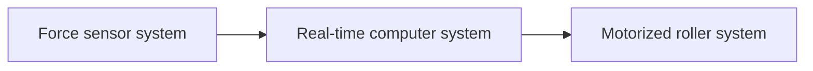
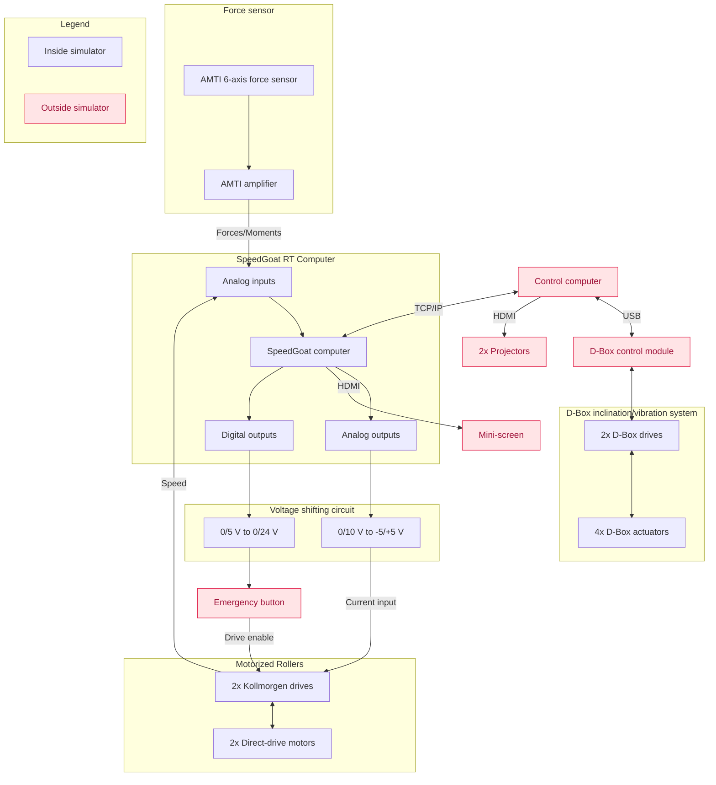

```mermaid
flowchart LR
    A["Force sensor system"]
    B["Real-time computer system"]
    C["Motorized roller system"]

    A --> B
    B --> C

    click A "force-sensor-system"
```

```mermaid
flowchart TD
    subgraph sub_1 ["D-Box inclination/vibration system"]
        step_1["2x D-Box drives"]
        step_2["4x D-Box actuators"]
    end

    subgraph sub_2 ["SpeedGoat RT Computer"]
        step_7["Analog inputs"]
        step_5["SpeedGoat computer"]
        step_6["Analog outputs"]
        step_14["Digital outputs"]
    end

    subgraph sub_4 ["Motorized Rollers"]
        step_8["2x Kollmorgen drives"]
        step_10["2x Direct-drive motors"]
    end

    subgraph sub_6 ["Voltage shifting circuit"]
        step_15["0/10 V to -5/+5 V"]
        step_16["0/5 V to 0/24 V"]
    end

    subgraph sub_7 ["Force sensor"]
        step_17["AMTI 6-axis force sensor"]
        step_18["AMTI amplifier"]
    end

    subgraph sub_8 ["Legend"]
        step_19["Inside simulator"]
        step_20["Outside simulator"]
    end

    step_4["Control computer"]
    step_3["D-Box control module"]
    step_11["Mini-screen"]
    step_13["Emergency button"]
    step_12["2x Projectors"]

    step_1 <--> step_2
    step_3 <--> step_1
    step_4 <-->|USB| step_3
    step_4 <-->|TCP/IP| step_5
    step_5 --> step_6
    step_7 --> step_5
    step_8 <--> step_10
    step_5 -->|HDMI| step_11
    step_4 -->|HDMI| step_12
    step_5 --> step_14
    step_6 --> step_15
    step_15 -->|Current input| step_8
    step_14 --> step_16
    step_16 --> step_13
    step_17 --> step_18
    step_18 -->|Forces/Moments| step_7
    step_13 -->|Drive enable| step_8
    step_8 -->|Speed| step_7

    style step_20 fill:#ffe4e6,stroke:#e11d48,color:#9f1239
    style sub_8 stroke-dasharray:none
    style step_4 fill:#ffe4e6,stroke:#e11d48,color:#9f1239
    style step_12 fill:#ffe4e6,stroke:#e11d48,color:#9f1239
    style step_3 fill:#ffe4e6,stroke:#e11d48,color:#9f1239
    style step_11 fill:#ffe4e6,stroke:#e11d48,color:#9f1239
    style step_13 fill:#ffe4e6,stroke:#e11d48,color:#9f1239
```

