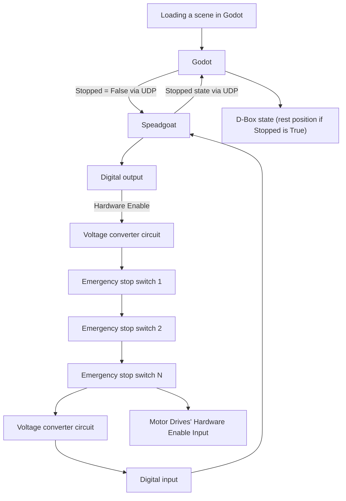

# Emergency stop system

Here is the complete activation/stop chain that ensures both the motorized rollers and D-Box system are stopped in case of problem.

```mermaid
flowchart TD
    step_1["Loading a scene in Godot"]
    step_2["Godot"]
    step_3["Speadgoat"]
    step_4["Voltage converter circuit"]
    step_5["Digital output"]
    step_6["Emergency stop switch 1"]
    step_7["Emergency stop switch 2"]
    step_8["Emergency stop switch N"]
    step_9["Voltage converter circuit"]
    step_10["Motor Drives' Hardware Enable Input"]
    step_11["Digital input"]
    step_12["D-Box state (rest position if Stopped is True)"]

    step_1 --> step_2
    step_2 -->|Stopped = False via UDP| step_3
    step_3 --> step_5
    step_5 -->|Hardware Enable| step_4
    step_4 --> step_6
    step_6 --> step_7
    step_7 --> step_8
    step_8 --> step_9
    step_8 --> step_10
    step_9 --> step_11
    step_11 --> step_3
    step_3 -->|Stopped state via UDP| step_2
    step_2 --> step_12
```
