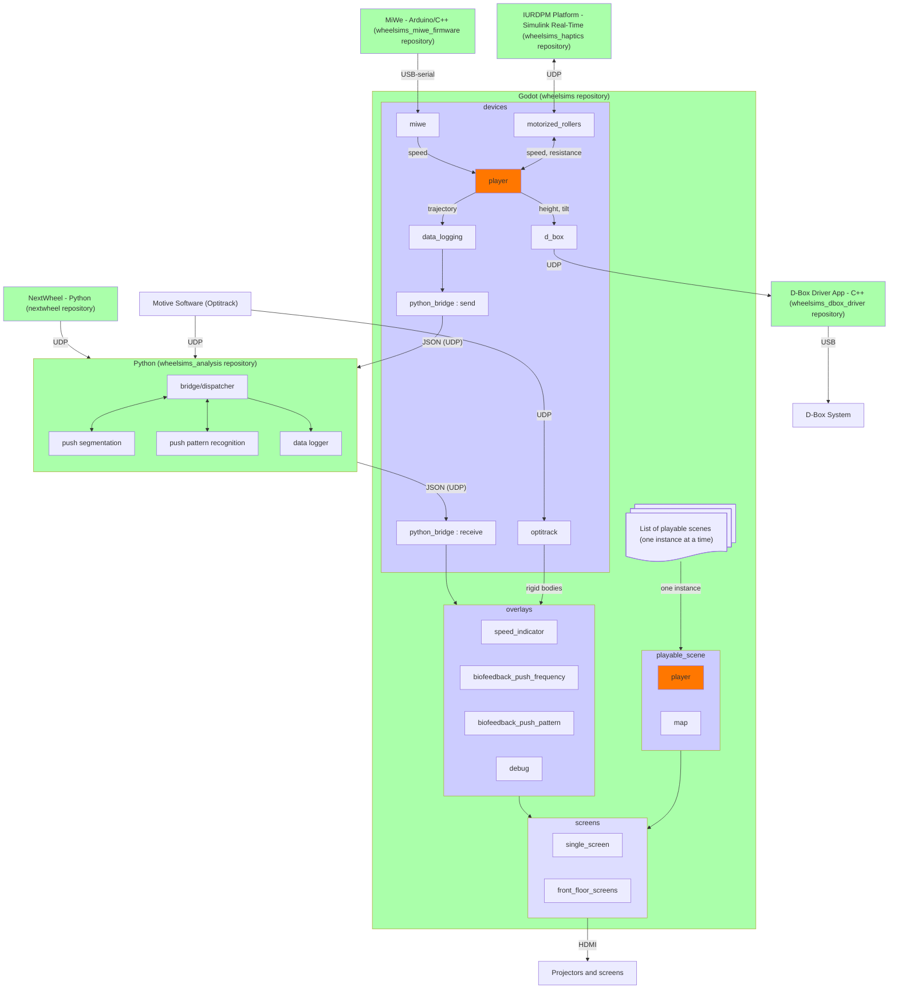

```mermaid
flowchart TD

slrt["IURDPM Platform - Simulink Real-Time (wheelsims_haptics repository)"]
style slrt fill:#afa
slrt <--> |UDP| devices_motorized_rollers

miwe["MiWe - Arduino/C++ (wheelsims_miwe_firmware repository)"]
style miwe fill:#afa
miwe --> |USB-serial| devices_miwe

motive["Motive Software (Optitrack)"]
motive --> |UDP| devices_optitrack
motive --> |UDP| python

nextwheel["NextWheel - Python (nextwheel repository)"]
style nextwheel fill:#afa
nextwheel --> |UDP| python

subgraph godot ["Godot (wheelsims repository)"]
    style godot fill:#afa

    playable_scene_list@{shape: docs, label: "List of playable scenes (one instance at a time)"}

    subgraph playable_scene
        style playable_scene fill:#ccf
        scene_player[player]:::player
        classDef player fill:#f70
        map
    end
    playable_scene_list --> |one instance| playable_scene

    subgraph overlays
        style overlays fill:#ccf
        overlays_speed_indicator[speed_indicator]
        overlays_biofeedback_push_frequency[biofeedback_push_frequency]
        overlays_biofeedback_push_pattern[biofeedback_push_pattern]
        overlays_debug[debug]
    end
    
    subgraph devices
        style devices fill:#ccf
        player:::player
        devices_motorized_rollers[motorized_rollers]
        devices_miwe[miwe]
        devices_d_box[d_box]
        devices_data_logging[data_logging]
        devices_optitrack[optitrack]
        python_bridge_send[python_bridge : send]
        python_bridge_receive[python_bridge : receive]
   
    end
    devices_motorized_rollers <--> |speed, resistance| player
    
    devices_miwe --> |speed| player
    devices_optitrack --> |rigid bodies| overlays
    player --> |height, tilt| devices_d_box
    player --> |trajectory| devices_data_logging
    
    
    python_bridge_receive --> overlays
    devices_data_logging --> python_bridge_send
    
    subgraph screens
        style screens fill:#ddf
        single_screen
        front_floor_screens
    end
    playable_scene --> screens
    overlays --> screens
    
end


projectors_and_screens[Projectors and screens]
screens --> |HDMI| projectors_and_screens

subgraph python["Python (wheelsims_analysis repository)"]
    direction TD
    style python fill:#afa
    python_python_bridge["bridge/dispatcher"]
    python_push_segmentation["push segmentation"]
    python_push_pattern["push pattern recognition"]
    python_data_logger["data logger"]
    
    python_python_bridge <--> python_push_segmentation
    python_python_bridge <--> python_push_pattern
    python_python_bridge --> python_data_logger
end
python_bridge_send --> |"JSON (UDP)"| python
python --> |"JSON (UDP)"| python_bridge_receive

d_box_driver_app["D-Box Driver App - C++ (wheelsims_dbox_driver repository)"]
style d_box_driver_app fill:#afa

d_box_system[D-Box System]
devices_d_box --> |UDP| d_box_driver_app
d_box_driver_app --> |USB| d_box_system
```
