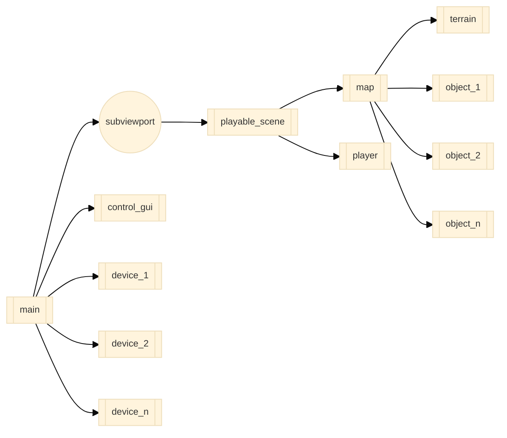

# Wheelsims Node Model

In the figure below, each node of this type:

```mermaid
---
config:
  theme: 'base'
  themeVariables:
    fontSize: 11px;
---
  
graph LR;

classDef node font-size:8pt important!;

node[[node]]
```

corresponds to a scene saved as a separate `.tscn` file.

- The [terrain](developing_new_terrains.md) node represents the surface and walls of the map. For instance, roads, alleys, building facades. In other words, where the player go. It is generally a single FBX file and is designed in Blender. It does not include objects such as trees, benches or other stuff.
- The [map](developing_new_maps.md) node combines a terrain with different [static objects](developing_new_static_objects.md) or animated objects (e.g., trees, cars, street lights). It also defines the navigation regions for the NPCs, and the static bodies for the ground surfaces and walls.
- The [playable_scene](developing_new_playable_scenes.md) node adds the `player` to the map. It can also integrate game elements. A `playable_scene` can therefore be ran by itself so that we can test the scene or game separately. Examples include:
    - `playable_scenes/park.tscn`
    - `playable_scenes/street_corner.tscn`
    - `playable_scenes/obstacle_race.tscn`
- The `control_gui` node is the user interface shown to the operator when we launch the application. It allows the operator to set configuration options and to load and launch a scene from the `playable_scenes` folder.
- When running the main application, the playable_scene is rendered under a separate viewport, which means that we cannot see the result by default. Using the configuration options, we must load a projector/screen configuration, for instance `single_screen.tscn` which creates a window that connects to the subviewport.
- Projection screens and overlays are considered as `devices`. Other devices can be loaded dynamically to communicate with external equipment or software. Examples of those devices include:
    - `devices/d_box/d_box.tscn`
    - `devices/optitrack/optitrack.tscn`
    - `devices/motorized_rollers/motorized_rollers.tscn`

In addition to this node arborescence, any node has access to these global nodes:

- `Config`: to retrieve or set configuration options that are saved locally on the computer, using `value = Config.get_value("CONFIG_ID")` or `Config.set_value("CONFIG_ID", value)`
- `Globals`: to have a direct reference to the current player if it is instantiated, using `player = Globals.player`. If the player is not instantiated yet, `Globals.player` is null. Such access to the current player helps a lot in creating dynamic objects that interact with the player, for example the crowd where each human always face the player.
